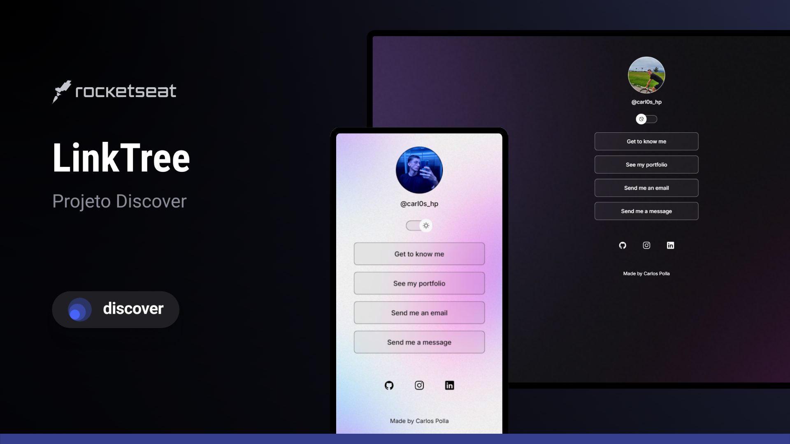

<h1 align="center"> LinkTree </h1>

This project is based on rocketseat's Discover course

  <a href="#-tecnologias">Technologies</a>&nbsp;&nbsp;&nbsp;|&nbsp;&nbsp;&nbsp;
  <a href="#-projeto">Project</a>&nbsp;&nbsp;&nbsp;|&nbsp;&nbsp;&nbsp;
  <a href="#-layout">Layout</a>&nbsp;&nbsp;&nbsp;|&nbsp;&nbsp;&nbsp;
  <a href="#memo-licença">License
</a>

  

 

  

## 🚀 Technologies

This project was developed with the following technologies:

- HTML and CSS
- JavaScript
- Git and Github
- Figma

## 💻 Project

LinkTree is a project designed to focus a person's links in one place and facilitate their dissemination.

## 🔖 Layout

You can view the project layout through [THIS LINK](https://www.figma.com/design/Vs37l75cWr0f8otUCkki7J/DevLinks-%E2%80%A2-Projeto-Discover-(Community)?m=auto&t=ZlrjgAug0Fun96f8-6). It is necessary to have an account [Figma](https://figma.com) to access it.

## 📝 License

This project is under the MIT license.

---

Made by Carlos Polla 